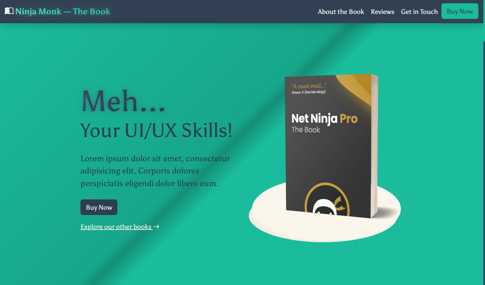

# Ninja Monk

<div align="center">

[](https://opensource.org/licenses/MIT)

</div>

<h2 align="center">The Ultimate Web Development Book 📚</h2>

<p>
A modern, responsive landing page for the "Ninja Monk" web development book, built with Bootstrap 5, JS, and SCSS.
</p>

## 🌐 Live Demo

[View Live Demo](https://ninja-monk-book.netlify.app/)

## 📷 Screenshot



## ✨ Features

- Modern, responsive design with dark theme 🌙
- Custom styled Bootstrap 5 components
- Advanced SCSS with custom properties and mixins
- Interactive elements: accordion, tooltips, modal, offcanvas
- Form validation with feedback
- SEO optimized structure and meta tags
- Smooth scrolling navigation
- Subtle animations and transitions
- Fully accessible components
- Mobile-first approach

## 🛠️ Technologies Used

- HTML5
- CSS3/SCSS
- JavaScript (ES6+)
- Bootstrap 5.3.5
- Bootstrap Icons
- Netlify for hosting

## 🚀 Getting Started

### Prerequisites

- Node.js (v14.0.0 or later)
- npm (v6.0.0 or later)

### Installation

1. Clone the repository

   ```bash
   git clone https://github.com/KeepSerene/bootstrap-v5-crash-course
   cd bootstrap-v5-crash-course
   ```

2. Install dependencies

   ```bash
   npm install
   ```

3. To compile SCSS (if you make changes)

   ```bash
   # If you're using a build tool like Sass CLI
   sass scss/main.scss css/main.min.css --style compressed
   ```

4. Open `index.html` in your browser or use a local server
   ```bash
   # If you have npx installed
   npx serve
   ```

## 📐 Design Notes

The website follows a dark theme inspired by the "Obsidian Depths" color palette, featuring:

- Primary color: #1abc9c (Turquoise)
- Secondary color: #2c3e50 (Dark slate)
- Background: #34495e (Medium slate)
- Text-on-dark: #ecf0f1 (Off-white)

Design highlights:

- Custom text gradients for headings
- Subtle paper texture overlays in gradient backgrounds
- Card-based pricing section with highlighted popular option
- Accordion for book contents
- Modal for newsletter subscription
- Offcanvas sidebar for related books
- Custom form styling and validation

## 🧩 Project Structure

```
ninja-monk-website/
│
├── index.html              # Main HTML file
├── package.json            # Node.js dependencies
├── README.md               # Project documentation
│
├── assets/                 # Images and static files
│   ├── ebook-cover.png
│   └── kindle.png
│
├── css/                    # Compiled CSS files
│   └── main.min.css
│
├── scss/                   # SCSS source files
│   ├── _variables.scss
│   ├── _components.scss
│   └── main.scss
│
├── js/                     # JavaScript files
│   └── main.js
│
└── screenshots/            # Project screenshots
    └── desktop-view.png
```

## 🌟 Key Components

1. **Header & Navigation** - Fixed header with responsive navigation menu
2. **Hero Section** - Full-height banner with CTA
3. **Pricing Plans** - Three-tier pricing cards
4. **Book Contents** - Accordion showing book chapters
5. **Reviews** - Testimonials with star ratings
6. **Contact Form** - Form with validation
7. **Newsletter Signup** - Modal with email subscription
8. **Footer** - Site links and copyright info
9. **Offcanvas Sidebar** - Related book titles

## 📱 Responsive Behavior

The website is fully responsive and optimized for:

- Mobile phones (320px+)
- Tablets (768px+)
- Desktops (992px+)
- Large screens (1200px+)

## 🔥 Performance Optimization

- Minified CSS and JS
- Optimized images
- Lazy loading for non-critical resources
- Minimal third-party dependencies
- Custom Bootstrap build to reduce file size

## 🚀 Deployment

The site is deployed on Netlify with continuous deployment from the GitHub repository. Each push to the main branch triggers a new build and deployment.

### Deployment Steps

1. Connect your GitHub repository to Netlify
2. Set the build command (if needed): `npm run build`
3. Set the publish directory: `.` (root directory)
4. Configure custom domain if desired

## 👥 Authors

- **Dhrubajyoti Bhattacharjee** - _Design & Development_
- [GitHub Profile](https://github.com/KeepSerene)

## 📜 License

This project is licensed under the MIT License - see the LICENSE file for details.

## 🙏 Acknowledgments

- Bootstrap team for the amazing framework
- Google Fonts for the Asul typeface
- Netlify for free hosting
